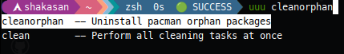
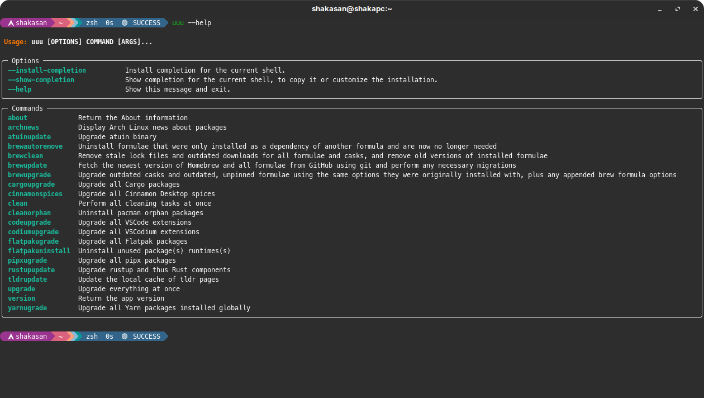

# Universal Upgrader Utility

    

A tiny utility to update/clean your system

> Remark : this an alpha version of a personal tool, so use it at your own risk ;-)

## What UUU can do for you ?

### Upgrade

- Atuin binary
- Cargo packages installed globally
- Cinnamon Desktop spices
- Flatpak packages
- Homebrew
  - Fetch the newest version of Homebrew and all formulae from GitHub using git and perform any necessary migrations
  - Upgrade outdated casks and outdated, unpinned formulae using the same options they were originally installed with, plus any appended brew formula options
- Local cache of tldr pages
- Pipx packages
- Rustup
- Yarn packages installed globally
- VSCode extensions
- VSCodium extensions

### Cleanup

- Pacman orphaned packages
- Remove stale lock files and outdated downloads for all formulae and casks, and remove old versions of installed formulae
- Uninstall formulae that were only installed as a dependency of another formula and are now no longer needed
- Unused Flatpak package(s) runtime(s)

## Install

Via pipx

```bash
pipx install universal-upgrader-utility
```

## Install autocompletion

Simply as

```bash
uuu --install-completion
```

And should look like (zsh shell in my case)



## UUU Help

```bash
uuu --help
```



## Dependencies

- Typer

## Licence & Credits

- Author : Francois B (Makoto)
- Licence : GPL-3.0 or above
